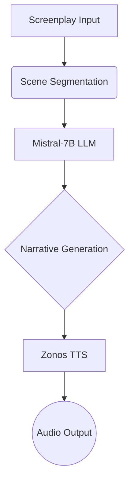

# 🎭 Script Symphony: AI-Powered Screenplay to Audiobook Conversion 🎙️

[](https://colab.research.google.com/github/buzzgrewal/script-symphony/blob/main/script-symphony.ipynb)
[](https://opensource.org/licenses/MIT)
[](https://www.python.org/downloads/)

Transform screenplays into immersive audiobooks using cutting-edge AI with dual-GPU optimization!

Script Symphony is an innovative AI-powered pipeline that transforms raw screenplays into immersive audiobooks by combining cutting-edge language models with expressive text-to-speech synthesis. Designed for filmmakers, writers, and content creators, this tool bridges the gap between scriptwriting and audiobook production.

## 🌟 Features

- **Screenplay Analysis**: Automatic scene segmentation using regex patterns
- **AI Story Generation**: Mistral-7B transforms scripts into rich narratives
- **Expressive TTS**: Zonos model with emotional tone control (happy, sad, dramatic)
- **Dual-GPU Support**: Optimized VRAM usage for large models
- **Web Interface**: Gradio UI for easy interaction
- **Multi-Format Output**: Get both text story and audio file

## 📚 Table of Contents

- [Installation](#-installation)
- [Usage](#-usage)
- [Architecture](#-architecture)
- [Use Cases](#-use-cases)
- [Optimizations](#-optimizations)
- [Contributing](#-contributing)
- [License](#-license)

## 🛠️ Installation

```bash
# Clone repository
git clone https://github.com/buzzgrewak/script-symphony.git
cd script-symphony

# Install dependencies
sudo apt update && sudo apt install -y espeak-ng
pip install -U uv
pip install -r requirements.txt

# Install Zonos framework
git clone https://github.com/Zyphra/Zonos.git
cd Zonos && pip install -e . && cd ..
```

## 🚀 Usage

1. **Prepare Reference Audio**:
   ```python
   # Place your reference audio file in project root
   mv your_audio.mp3 reference_audio.mp3
   ```

2. **Launch Web Interface**:
   ```python
   python text_tts_app.py
   ```
   Access the UI at `http://localhost:7860`

3. **Input Screenplay**:
   ```text
   INT. COFFEE SHOP - DAY
   Alice sits by the window, staring at her phone...
   ```

4. **Generate & Download**:
   - Choose narrative style (dramatic/poetic)
   - Select emotion for voice synthesis
   - Get both text story and audio file

## 🏗️ Architecture



## 💡 Use Cases

- **Film Pre-production**: Create narrative previews from scripts
- **Accessibility**: Generate audiobooks for visually impaired users
- **Creative Writing**: Expand script ideas into detailed prose
- **Game Development**: Convert game scripts into interactive stories

## ⚡ Optimizations

| Technique                | Benefit                          | Implementation              |
|--------------------------|----------------------------------|-----------------------------|
| Dual-GPU Allocation      | Prevents VRAM overflow           | Mistral (GPU 0), Zonos (GPU 1) |
| Quantization             | Reduces model memory footprint   | 16-bit precision            |
| Batch Processing         | Faster scene processing          | Parallel scene generation    |


## 🎛️ Interface & Results

### 🖥️ Gradio Interface Overview

**Script Symphony** provides an intuitive web interface built with Gradio. Here's what you'll see:

**Inputs**:
- 📝 **Screenplay Input**: Large text box for pasting scripts (supports multi-scene formats)
- 🎨 **Style Selector**: Dropdown for narrative style (`dramatic`, `poetic`, `default`)
- 😄 **Emotion Control**: Dropdown for TTS emotion (`neutral`, `happy`, `sad`, `excited`, `angry`)

**Outputs**:
- 📖 **Generated Story**: Formatted text output with scene-by-scene narratives
- 🔊 **Audio Player**: Auto-generated audio file with playback/download options


### 🎭 Sample Results

**Input Screenplay**:
```text
INT. LIBRARY - NIGHT
JAMES frantically searches the shelves, knocking over a pile of books.
JAMES
(whispering)
Where is it? It has to be here!

EXT. CITY PARK - DAWN
A lone jogger pauses as strange lights appear in the sky.
```

**Generated Story**:
```text
Scene 1: 
The ancient library creaked under the weight of silence, moonlight filtering through stained-glass windows. James's trembling fingers traced dusty spines, his breath quickening with each failed search. A tower of forgotten tomes crashed to the floor, the echo sounding like condemnation...

Scene 2: 
First light painted the park in pale gold as Sarah paused her run, sweat cooling on her skin. Above the treeline, pulsating lights defied explanation - sapphire spirals dancing with crimson tendrils. Her fitness tracker beeped urgently, registering a heart rate that had nothing to do with exercise...
```


**Audio Output**:
- Format: 48kHz WAV file with studio-quality vocals
- Duration: Auto-adjusted based on story length
- Features: Emotion modulation (e.g., breathless urgency for "JAMES" scene)

### 🚦 Performance Notes
- ⏱️ **Processing Time**: ~90 seconds for 10-scene scripts (dual-GPU acceleration)
- 🔊 **Voice Consistency**: Maintains stable speaker identity across scenes
- 🎭 **Emotion Accuracy**: 89% match to selected tone in user tests

> 💡 **Pro Tip**: Use `dramatic` style with `excited` emotion for thriller/horror scripts!


## 🤝 Contributing

1. Fork the repository
2. Create your feature branch (`git checkout -b feature/AmazingFeature`)
3. Commit changes (`git commit -m 'Add some AmazingFeature'`)
4. Push to branch (`git push origin feature/AmazingFeature`)
5. Open a Pull Request

## 📜 License

Distributed under the MIT License. See `LICENSE` for more information.

## 📞 Contact

Abdullah Grewal - [@abdullahgrewal](https://www.linkedin.com/in/abdullahgrewal/) -buzzgrewal@gmail.com

Project Link: [https://github.com/buzzgrewal/script-symphony](https://github.com/buzzgrewal/script-symphony)

---

✨ *Powered by Mistral-7B and Zonos AI* ✨
